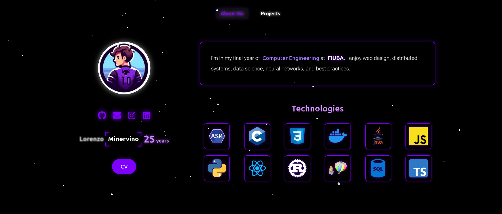
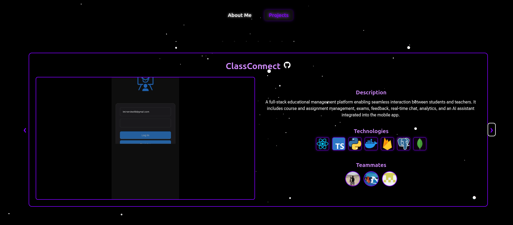

# Personal Portfolio – Lorenzo Minervino

This is my personal portfolio built with React, TypeScript and Vite. It showcases my academic background, skills, and selected projects as a Computer Engineering student.

## Overview

This project combines a clean UI with responsive design and subtle interactions, all optimized for performance and accessibility.

- Built with **React + Vite + TypeScript**
- Animations powered by **Framer Motion**
- Uses [React Bits](https://reactbits.dev/) for high-quality reusable components
- Fully responsive layout
- Modular architecture with reusable hooks and logic

## Screenshots

### About Me



### Projects



## Stack and Tooling

- **React + TypeScript + Vite** for fast development and build performance
- **Framer Motion** for smooth and declarative animations
- **Custom Hooks** for handling proximity effects and interactivity
- **ESLint + TypeScript ESLint** with optional type-aware linting
- **React Bits** components for flexible and accessible UI primitives

## Getting Started

To install dependencies and start the development server:

```bash
npm install
npm run dev
```
Requires Node.js 18+

## React Bits

This project uses React Bits, a modern component library offering composable and accessible building blocks for React. It helped accelerate the layout and structure of this site while maintaining flexibility and performance.

## Contact

You can connect with me on [LinkedIn](https://www.linkedin.com/in/lorenzominervino/) or visit my [GitHub](https://github.com/lminervino18).

Email: lminervino18@gmail.com
